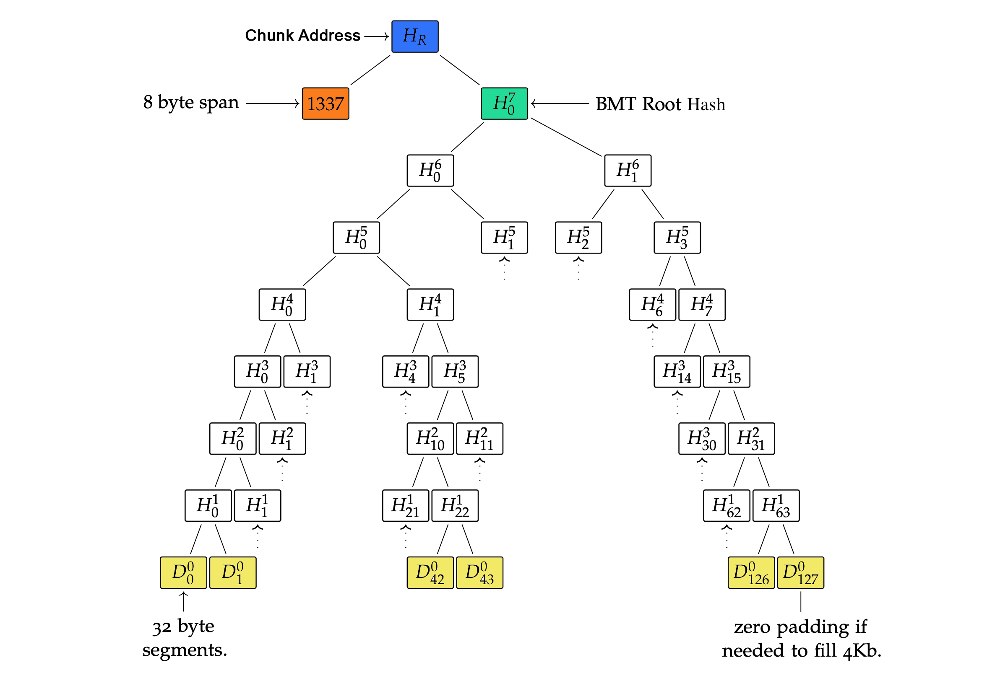
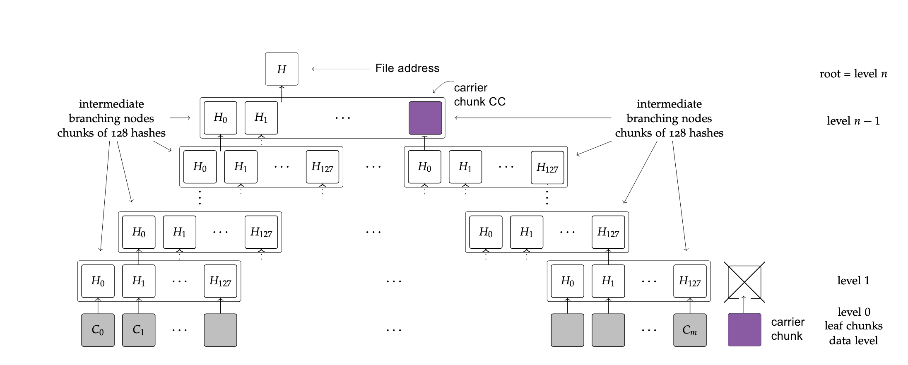
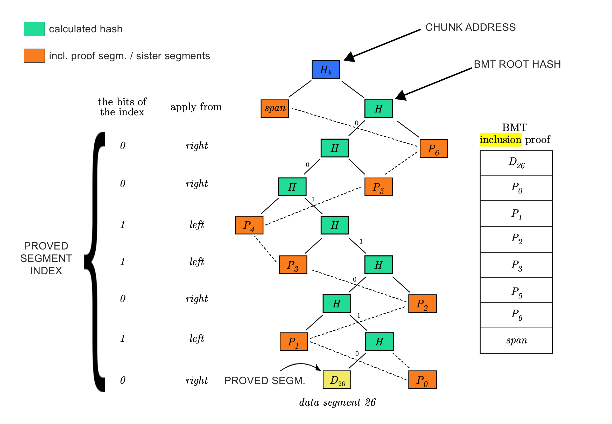

# Bmt-py

<p align="center">
    <em>Binary Merkle Tree operations on data</em>
</p>

<div align="center">

| Feature       | Value                     |
| ------------- | -------------------------------------------------------------------------------------------------------------------------------------------------------------------------------------------------------------------------------------------------------------------------------------------------------------------------------------------------------------------------------------------------------------------------------------------------------------------------------------------------------------------------------------------------------------------------------------------------------------------------------------------------------------------------------------------------------------- |
| Technology    | [](https://www.python.org/) [](https://github.com/pypa/hatch) [](https://github.com/features/actions) [](https://github.com/aviksaikat/bmt-py/actions/workflows/tests.yml/badge.svg)                           |
| Type Checking | [](https://github.com/astral-sh/ruff) [](http://mypy-lang.org/)                                                                                                                                                                                                                                                                                                                                                                                                                                                     |
| CI/CD         | [](https://github.com/Aviksaikat/bmt-py/actions/workflows/build.yml) [](https://github.com/aviksaikat/bmt-py/actions/workflows/tests.yml) [](https://github.com/aviksaikat/bmt-py/actions/workflows/labeler.yml) [](https://github.com/pre-commit/pre-commit)                                                                                                                                                                                                            |
| Docs          | [](https://aviksaikat.github.io/bmt_py/)                                                                                                                                                                                                                                                                                                                                                                                                                                                                                                                                                                               |
| Package       | [](https://pypi.org/project/bmt_py/) [](https://pypi.org/project/bmt_py/) [](https://pypi.org/project/bmt_py/)                                                                                                                                                                                                                                                                                                                                                                                                        |
| Meta          | [](https://github.com/aviksaikat/bmt-py/blob/main/LICENSE) [](https://github.com/aviksaikat/bmt-py/commits/main) [](https://github.com/aviksaikat/bmt-py/graphs/commit-activity) [](https://github.com/aviksaikat/bmt-py) |

</div>

# Usage

```py
>>> from bmt_py import make_chunk

>>> payload = bytes([1, 2, 3])
>>> chunk = make_chunk(payload)
>>> result = chunk.address()
>>> print(bytes_to_hex(result, 64))
# ca6357a08e317d15ec560fef34e4c45f8f19f01c372aa70f1da72bfa7f1a4338
```

- More examples are [here](https://aviksaikat.github.io/bmt-py/Usage).

<details open>
<summary>How it works</summary>
<br>

# How it works

First, it splits the data into `chunks` that have maximum 4KB payload by default, but this condition can modified as well as its `span` byte length (8 bytes) that indicates how long byte payload subsumed under the chunk.

If the payload byte length cannot fit exactly to this chunk division, the rightmost chunk's data will be padded with zeros in order to have fixed length data for the BMT operations.

This basic unit is also required to effectively distribute data on decentralized storage systems with regard to _plausible deniability_, _garbage collection_, _load balancing_ and else. 
For more details, please visit [Etherem Swarm]() webpage that has full implementation of this logic.

The used hashing algorithm is the `keccak256` function that results in a 32 bytes long `segment`.

Performing BMT hashing on the chunk data will define the `BMT root hash` of the chunk.
Then, for integrity considerations, the BMT root hash is hashed with the chunk's span from the left which takes the `Chunk address`.



In order to refer files also with a single 32 byte segment, the chunk addresses of the payload have to be hashed in the same way until the `File address`:

chunks can encapsulate 128 chunk addresses on the subsequent BMT tree level by default. These kind of chunks are called `Intermediate chunks`
By the properties of a BMT tree, the chunks will end in a `Root chunk` that refers all chunks below (directly or indirectly) and its address will be the `File address` as well.

One can realize, the BMT levels can have an orphan chunk on the rightmost-side that cannot be hashed with a neighbour chunk, because it does not have a neighbour chunk (e.g. 129/129 chunk).
When it occurs, it does not have a sense to hash this orphan chunk on every BMT level since it will be BMT hashed with zero data.
That's why the the algorithm handles orphan chunk as `Carrier chunk` and tries to place it into that BMT tree level where the chunk address can be encapsulated with other addresses.

This BMT hashing of data allows to reference any file with unified 32 bytes unique address which is called _content addressing_.



Nevertheless, it also allows to perform lightweight _compact inclusion proof_ on data.
This proof requires little amount of data to be provided for proving whether any particular segment (32 bytes) of the data is present at a particular offset under the file address.

This feature allows to create a logic around data referenced by 32 bytes file addresses where the data segment values have to meet some conditions.
The first/best use-case for this can happen via smart contracts that implement the validation functions that check the provided `inclusion proof segments` are indeed subsumed under the commited file references.

To get these inclusion segments, the library collects all required segments from the BMT tree that can be used for input of smart contract validation parameters.



</details>


---

**Documentation**: <a href="https://aviksaikat.github.io/bmt_py/" target="_blank">https://aviksaikat.github.io/bmt-py/</a>

**Source Code**: <a href="https://github.com/aviksaikat/bmt_py" target="_blank">https://github.com/aviksaikat/bmt-py</a>

---

<details open>
<summary>Development</summary>
<br>

## Development

### Setup environment

We use [Hatch](https://hatch.pypa.io/latest/install/) to manage the development environment and production build. Ensure it's installed on your system.

### Run unit tests

You can run all the tests with:

```bash
hatch run test
```

### Format the code

Execute the following command to apply linting and check typing:

```bash
hatch run lint
```

### Publish a new version

You can bump the version, create a commit and associated tag with one command:

```bash
hatch version patch
```

```bash
hatch version minor
```

```bash
hatch version major
```

Your default Git text editor will open so you can add information about the release.

When you push the tag on GitHub, the workflow will automatically publish it on PyPi and a GitHub release will be created as draft.

## Serve the documentation

You can serve the Mkdocs documentation with:

```bash
hatch run docs-serve
```

</details>

## License

This project is licensed under the terms of the [BSD-3-Clause](./LICENSE) license.
